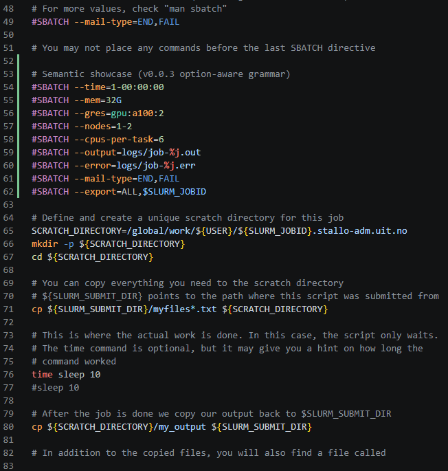
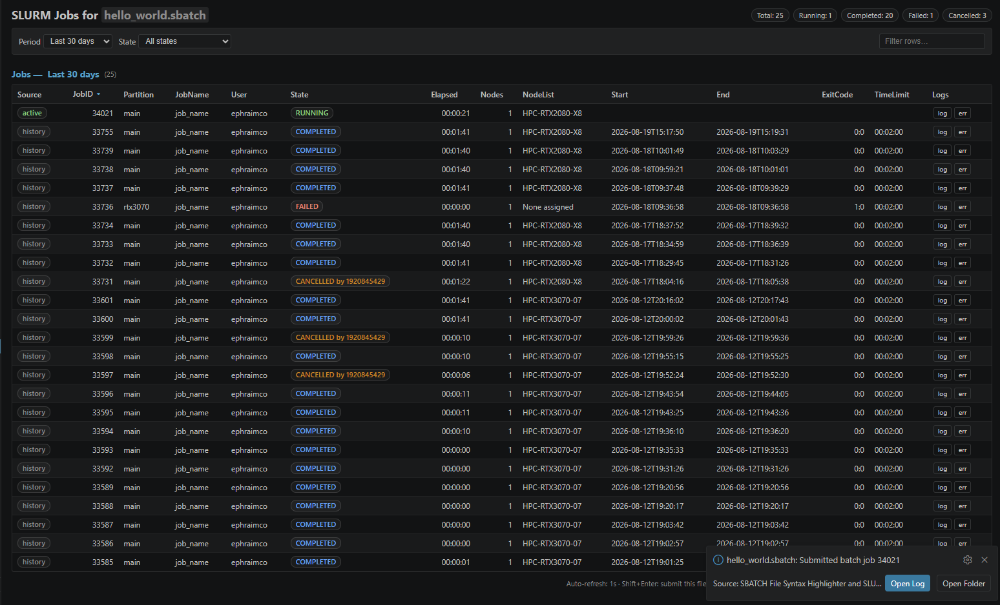

# SBATCH Syntax Highlighting and SLURM Job Submission for VS Code

This extension provides syntax highlighting and job submission features for `.sbatch` files used with SLURM job scheduling.

## Features

- Syntax highlighting for `.sbatch` files: seven semantic categories (directive, option, identifier, string/path, numeric, special, comment) with **option-aware value parsing** (`--mem=32G` → number + unit, `--time` literals, `%j` placeholders, GRES type/model/count, `$SLURM_*` variables).
- Linting of `#SBATCH` directives before submission (missing `--time`, conflicting `--mem`/`--mem-per-cpu`) with a **Submit Anyway** option.
- Right-click to submit a SLURM job — logs land next to the script, unsaved edits are saved first, and the popup offers **Open Log / Open Folder / View Details**.
- **Shift+Enter** submits the open script (from the editor or the job list).
- **Live job list** — a merged active + history table with 1-second auto-refresh, date-range and state filters, sortable columns, row search, summary chips, per-row **log/err** buttons, and click-to-cancel. Paints instantly from a per-file cache.
- Theme-aware webview that follows your VS Code theme (light / dark / high-contrast).
- Security: all SLURM commands run without a shell (no injection risk); webview inputs are validated; jobs are attributed per-script using the actual working directory.
- File icon for `.sbatch` files for easy identification.

## Installation

- Install the extension from the [VS Code Marketplace](https://marketplace.visualstudio.com/items?itemName=EphiCohen.sbatch).
- Or build and install from source (see [Development](#development)).

## How to Use

1. Open any `.sbatch` file in VS Code to see syntax highlighting.
2. Right-click on the `.sbatch` file in the file explorer and select:
   - **Submit a SLURM Job from This File** to submit the job. The default `slurm-<jobid>.out` log (or the path from the script's `--output`/`--error` directives) is written next to the script; the success popup lets you **Open Log** or **Open Folder**, and errors can be expanded via **View Details**.
   - **List Submitted Jobs from This File** to view active jobs and full accounting history in a single live table (auto-refreshes every second, theme-aware). Use the period selector (last 24 hours / 7 days / 30 days / all time / custom date range), the state filter, and the row search box to narrow results. Click column headers to sort; click active job rows to cancel them; use the **log**/**err** buttons on any row to open the job's output files. Press **Shift+Enter** (in the webview or in a `.sbatch` editor) to submit the file.

### Syntax Highlighting



Directives are highlighted in seven semantic categories (colors follow your theme):

| Category | Example | Scope |
|---|---|---|
| Purple · directive | `#SBATCH` | `keyword.control.sbatch` |
| Orange · options | `--mem`, `-N` | `variable.parameter.sbatch` |
| White · identifiers | `main`, `ALL`, `my_job` | (unscoped) |
| Blue · strings / paths | `"my log %j.err"`, `/Filepath`, emails | `string.*.sbatch` |
| Numeric · numbers & quantities | `4`, `5GB` (number + unit), `0-00:02:00` (time) | `constant.numeric.sbatch`, `constant.other.unit.sbatch`, `constant.numeric.time.sbatch` |
| Special · Slurm substitutions | `%j`, `%J`, `%A`, `$SLURM_JOBID`, `--gres=gpu:a100:2` | `constant.character.format.placeholder.sbatch`, `variable.language.slurm.sbatch`, `entity.name.type.resource.sbatch`, `entity.name.resource.sbatch` |
| Enum · known values | `ALL`, `BEGIN`, `END`, `FAIL`, `NONE` | `constant.language.sbatch` |
| Gray · comments | `##SBATCH`/`###SBATCH` disabled, `# comment` | `comment.line.*.sbatch` |

Structured values are parsed **in the context of their option** rather than colored wholesale: `--time` accepts only time literals, `--mem`/`--mem-per-cpu`/`--mem-per-gpu` only number + unit quantities, `--output`/`--error` a filename grammar with `%j`-style placeholders, `--nodes`/`--ntasks`/`--cpus-per-task`/`--gpus` numeric counts, and `--mail-type`/`--mail-on-event` known enum values (`ALL`, `BEGIN`, `END`, …). So `--mem=32G` splits into number + unit while `--job-name=32G` stays a plain value, and a partition named `END` is never colored as an enum. Slurm-provided variables (`$SLURM_JOBID`) are distinguished from ordinary shell variables (`$HOME`), any number of extra `#` characters disables a directive (`##SBATCH`, `###SBATCH`), and plain identifiers like `main` stay uncolored. Forms SLURM rejects are flagged with `invalid.illegal.sbatch` (dangling `--`, whitespace around `=`, e.g. `--job-name = x`). General comments and the rest of the file follow standard **bash** syntax colors.

#### Styling disabled directives distinctly

`##SBATCH` lines use the dedicated `comment.line.disabled.sbatch` scope, so you can give them a muted/italic look while keeping comment semantics. Add to your settings:

```json
"editor.tokenColorCustomizations": {
  "textMateRules": [
    {
      "scope": "comment.line.disabled.sbatch",
      "settings": { "fontStyle": "italic", "foreground": "#6f6f6f" }
    }
  ]
}
```

### Job Management



View SLURM jobs submitted from a specific `.sbatch` file in a single merged table (active + history): full accounting columns (Start, End, ExitCode, TimeLimit), configurable period (last 24 hours / 7 days / 30 days / all time / custom date range), a state filter, row search, sortable columns, and summary chips. The table **auto-refreshes every second**; running jobs' elapsed time ticks live. Click an **active** row to cancel it with `scancel`; use the **log**/**err** buttons on any row to open the job's stdout/stderr file.

## Requirements

Make sure `sbatch`, `squeue`, `sacct`, and `scancel` (SLURM commands) are available in your system's PATH. When working on a cluster login node, open the folder in VS Code via **Remote-SSH** so the extension runs where SLURM is installed.

## Development

### Prerequisites

- [Node.js](https://nodejs.org/en/download/) 18 or newer
- [VS Code](https://code.visualstudio.com/download)

### Setup and checks

```bash
npm install
npm test        # unit tests (44 at v0.0.3)
npm run lint    # ESLint
npm run package # build sbatch-<version>.vsix
```

### Development workflow

`main` is protected: work happens on feature branches and lands via pull requests with a green CI run (`.github/workflows/ci.yml` runs `lint` + `test`). Every task is tracked as a GitHub issue on the roadmap board, and commits reference their issue (`Fixes #N`).

1. Pick an issue from the board (or create one).
2. `git checkout -b feat/xxx` and implement.
3. `git push origin feat/xxx` → open a PR that closes the issue.
4. Merge when CI passes.

### Testing the extension on a remote host (Remote-SSH)

The extension talks to SLURM, so it must run on the machine where `sbatch`/`squeue`/`sacct`/`scancel` exist (typically a login node).

1. Install the **Remote - SSH** extension and connect to this host (`Remote-SSH: Connect to Host...`).
2. Open this repository as the remote workspace folder.
3. Run `npm install` in the remote terminal.
4. Press **F5** (or run the **Extension** launch config) - an Extension Development Host window opens **on the remote**, with the extension loaded.
5. In the new window:
   - Open `sample.sbatch` and verify highlighting (active `#SBATCH`, `##SBATCH` disabled lines, bash body).
   - Press `Ctrl+/` on a line to verify comment toggling now inserts `#`.
   - Right-click the file in the explorer → **Submit a SLURM Job from This File**.
   - Right-click → **List Submitted Jobs from This File** to see the webview.

Alternatively, build the package and install the `.vsix` in the remote:

```bash
npm run package   # creates sbatch-0.0.3.vsix
```

Then in the remote Extensions view: **⋯ → Install from VSIX...** and pick the file.

### Build instructions

1. Clone the repository.
2. Run `npm install` to install the dependencies.
3. Run `npm run package` to create the `.vsix` file.

To cut a release (once issues are merged):

```bash
git tag v0.0.3 && git push origin v0.0.3
git push origin main
gh release create v0.0.3 sbatch-0.0.3.vsix --generate-notes
```

> Publishing to the VS Code Marketplace is a separate step that requires a publisher token (`vsce publish`).

## Release Notes

For the license, see [LICENSE](./LICENSE.md)

See [CHANGELOG.md](./CHANGELOG.md) for detailed version history.

### 0.0.3
- Security: SLURM commands run without a shell (no injection risk); webview job IDs and log paths are validated; `findLogPaths` results are normalized.
- Grammar: seven semantic categories and option-aware value parsing (`--time`, `--mem*`, `--output/--error`, numeric counts, `--mail-type` enums, GRES type/model/count), `$SLURM_*` variables, `invalid.illegal` scope, disabled `##SBATCH`/`###SBATCH` directives.
- Job list: live 1s auto-refresh (client-rendered), single merged active + history table, date-range + state filters, sortable columns, row search, summary chips, theme-aware, per-row **log/err** buttons, click-to-cancel, per-file persistent cache, WorkDir-aware job attribution, dedupe of running jobs.
- Submit: logs next to the script, **Open Log / Open Folder / View Details**, lint before submit, save-before-submit, Shift+Enter keybinding.
- Fix: `Ctrl+/` comment toggling inserts `#`; extension activates only for `.sbatch`; README/CHANGELOG included in the package; progress notification ends with submission.
- Quality: 44 unit tests + ESLint + `npm run package`; CI workflow.

### 0.0.2
- Improved syntax highlighting for SLURM directives with better argument parsing
- Added language icon for `.sbatch` files
- New command to list active jobs submitted from a specific file
- Removed full icon theme (now using built-in language icon)

### 0.0.1
- Initial release with syntax highlighting and SLURM job submission command.

---

For more information, visit [our repository](https://github.com/ephi052/VS-Code-SBATCH-Syntax-Highlighting).


